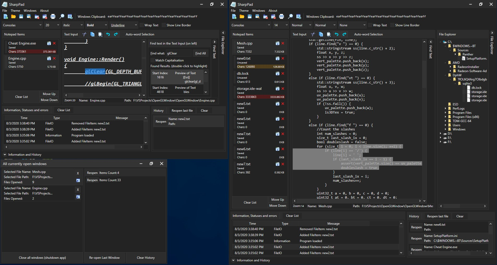

# SharpPad
Window's notepad is blindingly light themed, so i decided to make my own dark theme version with tabs and many other (probably useless) features. It uses WPF and MVVM (no MVVM Light or any nuget packages, i did it all myself). It's fairly robust, but it works. I dont think this program fully follow the MVVM standards, but who cares tbh
Here's a snapshot of the program, showing the infolist at the bottom, file explorer on the right, multiple NotepadListItems and loads of text. The find, file explorer and infolist can be closed/opened to take up less space also.

the pic shows 2 opened windows (top left and whole right side), and the window manager on the bottom left. that windows shows the opened windows and the closed ones (history)

## Info on how to use this program
NotepadListItems are the things on the left of the program, containing file and style info.
- Starting from the top, the titlebar. it does everything you'd expect.
- There's menus below that (file, theme, etc). File allows opening/saving/closing of NotepadListItems, and also has a thing for opening the preferences window. Theme allows you to change the application theme (dark/light). Windows lets you open the selected NotepadListItems in another window. Help... shows help :)
- Below, is some buttons. New File, Open File, Save, Save as, Close selected NotepadListItem, Close all NotepadListItems, Print selected file and Find. There's also the new feature to open a window which will show every Notepad window that's currently open. you can then manually close or focus them (double click or use buttons on the right side). and there's also the closed ones (history), allowing you to reopen them or clear the history And there's also the windows clipboard, in the Consolas font (right side of "Windows Clipboard:". This automatically updates whenever the windows clipboard changes, which is kind of a useless feature... but it doesn't cause any lag so might as well have it :) Clicking on the text opens a window containing the entire clipboard, incase you copied too much text to be displayed.
- Below that, for the NotepadListItem, the Font, FontSize, Thingy... Normal/Italic/Oblique, Normal/Bold/ExtraBold, and textdecorations like underlining and strikethrough, text wrapping (it also hides horizontal scrollbar) and the ability to hide the Selected Line Outline (more on that later when taking about the Text Editor)
- Then you have the notepads list to the left, containing NotepadListItem, aka files. Those NotepadListItem have a name, Saved/Unsaved tag, Character count and filesize in kb. There's a close button to the very right top, which will close/remove the NotepadListItem. There's also a grip on the left of the item; click and move your mouse to start dragging the item. this allows you to drag the file like you would in file explorer. At the bottom of the list is a button to clear all items. it has the same functionality as the button at the top.
- In the middle is the TextBox, i'll call the Text Editor. This is where all the text goes. At the top are the Cut/Copy/Paste/Undo/Redo and auto-word selection (which selects a whole word when you select the first few letters of a word) Right click for a contextmenu with the same functions. Below the TextBox is the ammount you've zoomed in/out (hold ctrl and scroll to zoom), which is actually just the fontsize :/, to the right is the FileName (in a textbox so you can change it), and next is the file's path (also editable).
    There's a rectangle around the current line you're on (aka on the caret index). it's slightly buggy when scrolling but apart from that, it's a good indicator as to which line you're on. 
- to the right is the Find panel. this allows you to find all occourances of text within the Text Editor. Double click the results in the list below to scroll to the result and select the result. Still trying to figure out how to auto-focus the Text Editor so that the selected text actually shows when unfocused. For now, you have to select some text initially and then double click a find result (a few times due to some bug) to scroll and select it.
- To the very right is the File Explorer. It's a tree based explorer, so double click to open/close trees of every folder and file. On files, there's a grip on the left which allows you to drag the file into the program (the notepads list)
- At the bottom is the Information and history lists. Information contains a list of info regarding things that have happened in the program (like Info, Statuses and errors). An example of info is creating a new file, opening one, saving one, Draging the NotepadListItem, or breaking the program somehow because i forgot to check if the file exists when saving or something lol. The history is obvious. When you close an item it adds it to the history. Click clear to permanently delete the closed items with no way to get them back.

## Updates history
- Added a new drag dropping thing. If the option is enabled (in File>Preferences -> Window) then files that dont exist (aka new files), if you dragdrop them somewhere on your PC, the file's path will automatically be set once the file watcher finds it. it can take a second for the path to update. It's slightly buggy if you drag drop files too quickly so add a 2 second delay between drag dropping.
- Added a history system to the windows (in the window management thingy), allowing you to reopen closed windows. can also use Ctrl + Shift + T to reopen them.
- Added a new window management system. At the top next to find is a button to open a window which will contain items which preview some stuff about the currently open windows. you can close and focus them with the buttons on the right or by double clicking. It might be slightly buggy however, but ive used it for a few hours and it's fine with no bugs.
- Added a new history system. If you close a file by accident, press Ctrl+Shift+T to reopen it. You can also reopen files manually by opening the Information and History expander at the bottom, and on the right are some items. Click Reopen or double click the items to reopen them.
- Added a properties window (File>Preferences) for editing things like whether holding shift + scrolling mouse wheel scrolls the text editor horizontally.
- Fixed TextDecorations not displaying properly in the ComboBox. Now it works :) Also, the FindResult panel has majestically shortened for some reason. To counter that, the items now have a maximum height of 120px, allowing multiple preview lines to me displayed. Its still a bit buggy but it should be okay.
- The windows clipboard is displayed at the top next to "Windows Clipboard:" and always updates with any change to the clipboard in or out of the program. will also display if the data is null... aka the data isnt a string (an image for example)
- Added more shortcut/hotkey commands. These can be found in the help menu at the top, and then at the bottom of the window that opens.
- There's a border around the line which the carex is on (aka the selected line outline). it's a bit buggy when vertically scrolling. There's a checkbox to disabled it (at the top next to wrapping). Also, the Text Editor is now it's own control... which inherits from TextBox. soon i might make my own texbox, but that'd take quite a long time.
- Added a file explorer (to the right) for fun, in case you want to navigate somewhere to drag a file. There's a grip on the right side of files (a checkerboard sort of thing, like with NotepadListItems). Click and move your mouse to drag it to the NotepadListItems list
- Also fixed DragDropping slightly. Before, you could drag the entire NotepadListItems. Now, you have to drag the grip (on the left of the item). This is makes sure you dont accidentally start dragging by accident
- Added ability to add extensions to file, or change the existing extension with another. can do this by right clicking the NotepadListItems and at the bottom is a dropdown menu with a list of extensions. Nifty feature tbh, but kinda useless as you could just rename the file. oh well.
- Added a list at the bottom for errors, alerts and information the programs throws. Click the expander to show it. Also added an orange/red ribbon to the NotepadListItems when the file size goes over 100kb/250kb, because at those points the program might lag.
- Added even more colourful icons, better than the other ones
- Added a Drag and Drop feature to the NotepadListItems. you can drag them to a folder, and it creates a file with the specified extension at that location. can also be used to transfer NotepadListItems between different windows
- Added a light theme, and also colourful themes too (4 themes in total: colourful light and dark, and normal light and dark)
- Can open selected notepad in another window (bugs may occour, so be careful with it)
- Auto-prompts you to save unsaved/edited work/files when you exit. Click no to just exit
- Added ability to change fonts/fontsizes/wrapping, etc. affects all of the text in the selected NotepadListItems because this isn't a rich text editor. 

## Errors:
I added a feature to open the selected notepad in another window. It's a bit broken. Try not to use it; closing the original mainwindow closes all other windows because of some error i couldnt fix. and some other things too. I added MainWindow to the titlebar, so that you know which window is which.

## Some 'code-level' info about it
the items on the left are a separate control (NotepadListItems), and their DataContext is a TextDocumentViewModel which contains a DocumentModel (containing path, filename, text, etc) and FormatModel (fontsize, wrapping, etc). When you select an item, it sets the Text Editor's DataContext as the selected NotepadListItems's DataContext (aka the TextDocumentViewModel). and through binding, it updates the view accordingly.

## other things
it's completely opensource so you can edit it and stuff. would be nice if you credited me if you post it somewhere else (or dont... not too bothered tbh) :)
